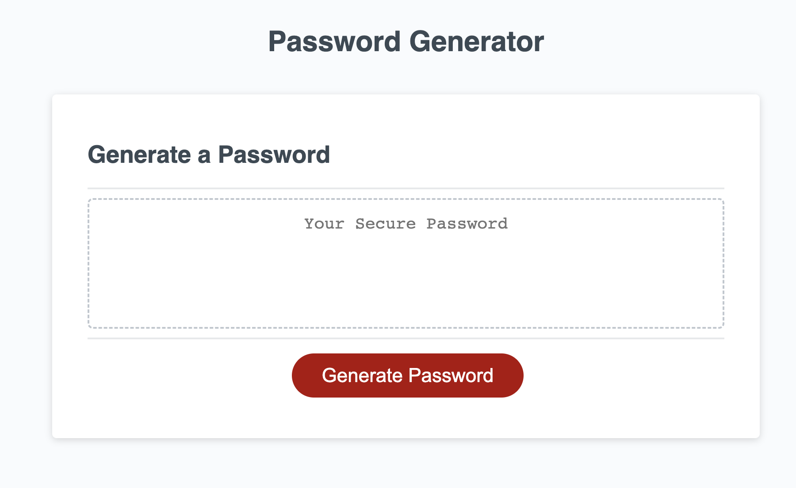

# password-generator

## project description

This project involved making a randomized password generator. In the application, an individual will click the generate button that will be accompanied with a series of questions. Each question answered in the loading page will help create the randomized password. It must include a specific character length and a combination of uppercase, lowercase, special characters and numbers.

This project solves an invidual's challenge in creating a completely randomized secure password. In this project, I learned about functions and loops in javascript. Additionally, I worked on my global scope and local scope for variables understanding.
## Usage

Website: https://lavollmer.github.io/password-generator/

Screenshot of website page is below.

## Credits

Collaborators include U of MN coding bootcamp tutor and U of MN coding bootcamp Fall 2023 classes.

Robby Kurle, tutor, helped with this section:
  for (var i = 0; i < numberOfCharacters; i++) {
    // select single random index from characterpool based on the characterpool's current length
    var getIndex = Math.floor(Math.random() * characterPool.length)
    //convert random index to true character value
    var characterValue = characterPool[getIndex];
    finalPassword.push(characterValue);
    console.log(finalPassword);
  }
  return finalPassword.join("");

He also helped with the concat method technical piece and building the characterPool section (the logic of creating one big pool).

## License
 
 MIT License 